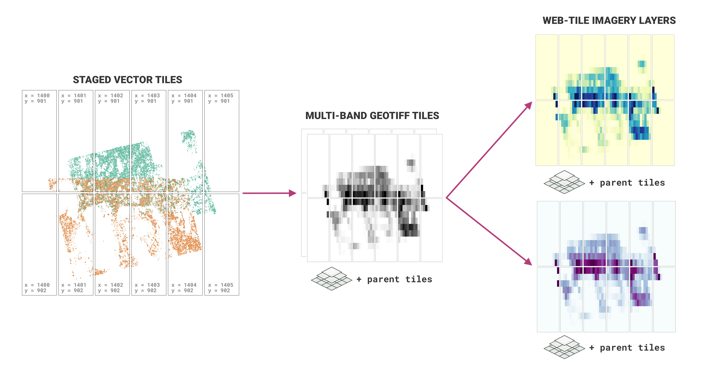

# Viz-raster: raster data processing for geospatial visualization (version 0.9.1)

- **Authors**: Robyn Thiessen-Bock ; Juliet Cohen ; Matthew B. Jones ; Lauren Walker
- **DOI**: [10.18739/A27W67732](https://ezid.cdlib.org/id/doi:10.18739/A27W67732)
- **License**: [Apache 2](https://opensource.org/license/apache-2-0/)
- [Package source code on GitHub](https://github.com/PermafrostDiscoveryGateway/viz-raster)
- [Submit bugs and feature requests](https://github.com/PermafrostDiscoveryGateway/viz-raster/issues/new)

Converts pre-tiled vector output from from the [PDG
viz-staging](https://github.com/PermafrostDiscoveryGateway/viz-staging) step
into a series of GeoTIFFs and web-ready image tiles at a range of zoom levels.
View the content under `example` to see the type of output produced. Most parts
of the process are configurable, including the methods used to summarize vector
data into rasters, the color palette, and the size of the tiles. See the
documentation in `ConfigManager.py` for more details.



## Citation

Cite this software as:

> Robyn Thiessen-Bock, Juliet Cohen, Matt Jones, Lauren Walker. 2023. Viz-raster: raster data processing for geospatial visualization (version 0.9.1). Arctic Data Center. doi: 10.18739/A27W67732

## Install

Requires Python version `3.9` or `3.10` and `libspatialindex` or `libspatialindex-dev`

1. Follow the instructions to install [`libspatialindex`](https://libspatialindex.org/en/latest/) or [`libspatialindex-dev`](https://packages.ubuntu.com/bionic/libspatialindex-dev)
2. Make sure that Python version 3.9 is installed (try `which python3.9`).
3. Install `pdgraster` from GitHub repo using pip: `pip install git+https://github.com/PermafrostDiscoveryGateway/viz-raster.git`

## Usage

1. Create a config JSON file for the raster job, see [PDG-Staging docs](https://github.com/PermafrostDiscoveryGateway/viz-staging/blob/develop//docs/config.md) for details,  `help(pdgstaging.ConfigManager)` for all configuration options, and `pdgstaging.ConfigManager.defaults` for default config values.

**From the command line:**
- run: `python -m pdgraster -c '/path/to/config.json'`

**In python:**
See [`example/main.py`](example/main.py) for a complete example.

## License

```
Copyright [2013] [Regents of the University of California]

Licensed under the Apache License, Version 2.0 (the "License");
you may not use this file except in compliance with the License.
You may obtain a copy of the License at

http://www.apache.org/licenses/LICENSE-2.0

Unless required by applicable law or agreed to in writing, software
distributed under the License is distributed on an "AS IS" BASIS,
WITHOUT WARRANTIES OR CONDITIONS OF ANY KIND, either express or implied.
See the License for the specific language governing permissions and
limitations under the License.
```